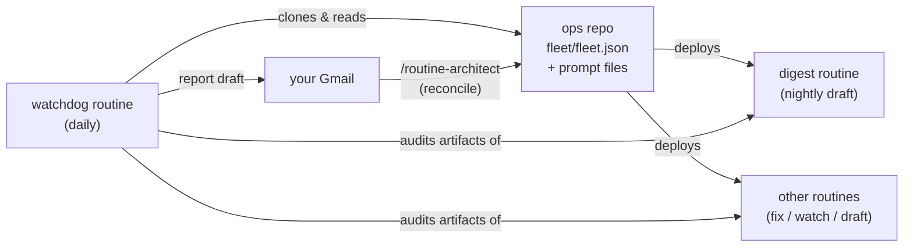

# routine-architect

**Wake up to a report on your own automation.** This is an
[Agent Skill](https://agentskills.io) for Claude Code that sets up a fleet
of scheduled cloud agents ("routines") for you — a nightly digest of what
happened in your repos, responders that investigate your error emails and
push fixes, watchers for deadlines and releases — plus a **watchdog** that
audits all of them daily, so a routine can never die silently.

Every morning, a draft like this is waiting in your Gmail (shown here with
the optional alert-responder upgrade installed; the starter fleet's first
report has just the digest line):

> **Routine watchdog — 2026-07-30**
>
> **code-digest: OK** — draft "Code digest — 2026-07-29" created 23:50,
> body summarizes 4 commits across 2 repos.
>
> **alert-responder: IDLE-OK** — no commits or log sections in the last
> 14h, and no [ERROR] alerts arrived either. Nothing required action.
>
> **Action needed:** None.
>
> `STATUS {"code-digest": "OK", "alert-responder": "IDLE-OK"}`

## Quickstart (~10 minutes)

Requirements: Claude Code on a plan with cloud routines, the Gmail
connector enabled on claude.ai, and a GitHub repo or two.

```
/plugin marketplace add alexgaoth/routine-architect
/plugin install routine-architect@alexgaoth-plugins
/routine-architect quickstart
```

Claude asks you **four questions** (which repos to watch, which repo the
fleet may write to, your email + timezone, anything agents must never
touch) and defaults every other decision — see
[`references/defaults.md`](references/defaults.md). **Have a todo list?**
Paste it (or point at your notes/board) and the fleet gets designed from
what's actually on your plate: each proposed routine quotes the item it
serves, and the things only you can do are handed back, not automated —
see [`references/todo-mapping.md`](references/todo-mapping.md). You get the **starter
fleet**: a nightly code digest plus the watchdog. Both are read-only; the
only thing they ever produce is drafts in your own Gmail. Next-day
upgrades, once you've seen it work: `/routine-architect add
alert-responder`, ntfy push escalation, more repos.

Prefer to see the end state first? [`examples/starter-fleet/`](examples/starter-fleet/)
is the complete ops-repo content the quickstart deploys, and it passes the
bundled validator as-is.

## How it works



Three ideas carry the whole design:

1. **A manifest is the source of truth.** Your fleet is described in
   `fleet/fleet.json` (+ exact prompt files) committed to one git "ops
   repo". Routines are deployed *from* it; a bundled validator checks it
   deterministically before anything deploys.
2. **Every routine leaves a machine-checkable artifact** — a dated Gmail
   draft, pushed commits, an append-only log section. That's how the
   watchdog (and you) can tell "idle" from "dead".
3. **Run once to set up, rerun to maintain.** The first run bootstraps
   everything; any later run *reconciles* — diffing the manifest against
   what's actually deployed and repairing gaps, orphans, drift, and stale
   config. Fast paths: `/routine-architect quickstart | reconcile | audit |
   add <archetype>`.

## Your first week

No mystery about what happens behind the curtain:

- **Day 0 (setup):** you answer the questions, see the fleet table and the
  runs/month estimate, and say yes before anything deploys. Offer at the
  end: run the watchdog once immediately so your first report arrives in
  minutes, not tomorrow.
- **Day 1 morning:** two drafts in Gmail — last night's code digest, and
  the watchdog's report on it (expect `code-digest: OK`).
- **Rest of week 1:** one digest + one watchdog report per day. `IDLE-OK`
  on quiet days is correct behavior, not a bug. If a routine breaks, the
  watchdog's report says so with evidence and an "Action needed" line —
  and only *repeat* failures escalate to `ALERT:`.
- **After a fully-green week:** reports compress to one line per routine.
  The healthy steady state is a glance, not a read. When you're ready:
  `/routine-architect add alert-responder` (or share your updated todo
  list and let it propose).

**The kill switch:** say "pause everything" to `/routine-architect` — every
managed routine including the watchdog is disabled immediately, before any
other bookkeeping. Resume the same way: routines you had individually
paused or retired earlier stay that way. (Belt-and-suspenders: every routine also has a manual
toggle at claude.ai/code/routines.)

## Making it yours

| you want | where to look |
|---|---|
| routines derived from your actual todo list | [`references/todo-mapping.md`](references/todo-mapping.md) — mapping rules, and what stays yours |
| a different mix of routines | [`references/routine-catalog.md`](references/routine-catalog.md) — 7 archetypes with example fleet shapes |
| ready-made prompts to fill in | [`templates/`](templates/) — one per archetype |
| push notifications, SMS, calendar, webhooks | [`references/notifications.md`](references/notifications.md) |
| different cadences / timezones | set `cadence_local` per routine; the validator recomputes UTC and catches DST drift |
| watchdog to buzz your phone on repeat failures | set `watchdog.escalation.ntfy_topic` — see [`references/watchdog.md`](references/watchdog.md) |
| the full rules (schema, reconcile algorithm) | [`references/fleet-manifest.md`](references/fleet-manifest.md) — the normative spec |

## FAQ

**What does it cost?** Each routine run is a cloud Claude session billed to
your plan's usage. The validator prints runs/month per routine before you
deploy (starter fleet: ~61 runs/month, mostly short sessions on Sonnet).

**Is it safe?** Defaults are deliberately conservative: drafts not sent
email, read-only wherever possible, append-only logs, no force-push, no
credentials anywhere in prompts or repos, least-privilege tool lists.
Write-access routines exist (the alert responder pushes fixes) but are
never part of the default setup — you opt in per routine.

**I already have routines I made by hand.** The skill detects them and
offers to adopt each into the manifest (so the watchdog covers it) or
record it as acknowledged-unmanaged. Nothing is changed without asking.

**How do I pause or delete a routine?** Pause: `/routine-architect` →
"pause X" (sets manifest status, disables deployment). Deletion is manual
by design, on claude.ai's routines page — the skill never deletes.

**Can routines see my laptop / my .env files?** No. They run in isolated
cloud sandboxes with fresh clones of the repos you granted. Gitignored
files don't exist there; a routine can detect that a credential is probably
missing in production but only you can supply it.

## Troubleshooting

| symptom | likely cause → fix |
|---|---|
| "Gmail tools not available" during setup | connector not enabled → claude.ai/customize/connectors, then rerun |
| routine deployed but no draft ever appears | check the routine's page under claude.ai/code/routines for run errors; then `/routine-architect audit` |
| watchdog reports FAIL for a routine | read its evidence section; if the routine is genuinely broken, `/routine-architect reconcile` repairs config-level causes |
| watchdog itself missing / reports stopped | `/routine-architect` — reconcile detects a missing watchdog and redeploys it |
| "skill not found" when a routine fires | routines run in the cloud and can't see `~/.claude/skills` — this skill is only needed in your interactive sessions, not inside routines |
| times drifted an hour after DST | run `/routine-architect reconcile` — the validator flags it and re-derives crons from your local intent |

## Repository layout

```
routine-architect/
├── SKILL.md                  # entrypoint the agent follows
├── references/               # loaded on demand: catalog, manifest spec,
│                             #   prompt patterns, watchdog, channels,
│                             #   defaults, API reference
├── templates/                # fill-in prompt per archetype
├── examples/starter-fleet/   # complete validator-passing ops repo content
├── scripts/validate_fleet.py # deterministic manifest validator
└── evals/                    # test scenarios for skill maintainers
```

No plugin? Copy this folder to `~/.claude/skills/routine-architect/`
instead — everything works the same.

MIT-style: use, modify, share freely.
